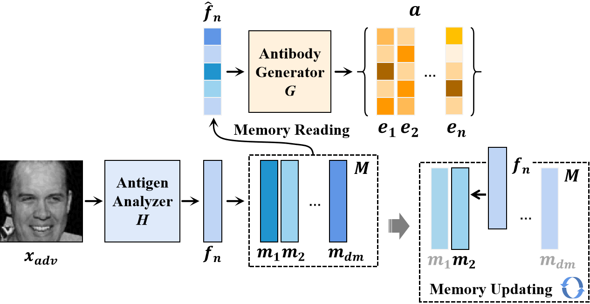
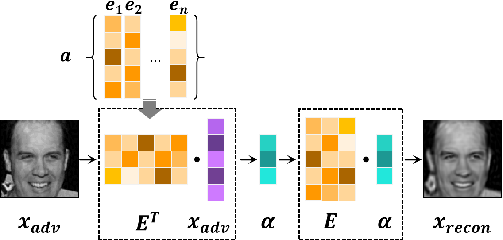
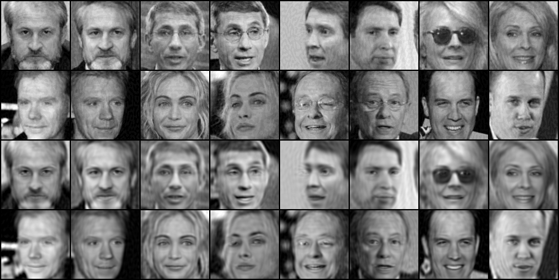

# Artificial Immune System of Secure Face Recognition Against Adversarial Attacks
Deep learning-based face recognition models are vulnerable to adversarial attacks. In contrast to general noises, the presence of imperceptible adversarial noises can lead to catastrophic errors in deep face recognition models. The primary difference between adversarial noise and general noise lies in its specificity. Adversarial attack methods give rise to noises tailored to the characteristics of the individual image and recognition model at hand. Diverse samples and recognition models can engender specific adversarial noise patterns, which pose significant challenges for adversarial defense. Addressing this challenge in the realm of face recognition presents a more formidable endeavor due to the inherent nature of face recognition as an open set task. In order to tackle this challenge, it is imperative to employ customized processing for each individual input sample. Drawing inspiration from the biological immune system, which can identify and respond to various threats, this paper aims to create an artificial immune system (AIS) to provide adversarial defense for face recognition. The proposed defense model incorporates the principles of antibody cloning, mutation, selection, and memory mechanisms to generate a distinct ``antibody" for each input sample, wherein the term "antibody" refers to a specialized noise removal manner. Furthermore, we introduce a self-supervised adversarial training mechanism that serves as a simulated rehearsal of immune system invasions. Extensive experimental results demonstrate the efficacy of the proposed method, surpassing state-of-the-art adversarial defense methods.

## The proposed framework

# Usage Instructions

## Requirments

python == 3.7

pytorch == 1.6.0

torchvision == 0.7.0

## Training

### Data preparing

The proposed model is trained on [CelebA](https://mmlab.ie.cuhk.edu.hk/projects/CelebA.html), which comprises a substantial collection of 202,599 facial images.

`train.py` to train the defense model.

## Facial image reconstruction

`recon_face.py` to reconstruct facial image.

Pretrained model can be downloaded from [Baidu Netdisk](https://pan.baidu.com/s/1fOkdHLThw5x0QiFT2f5zYQ), code: g3sn
or [Google Drive](https://drive.google.com/drive/folders/1It2f9mif3zdQJmu83LgFMCTwo9sAm8Od?usp=sharing)

